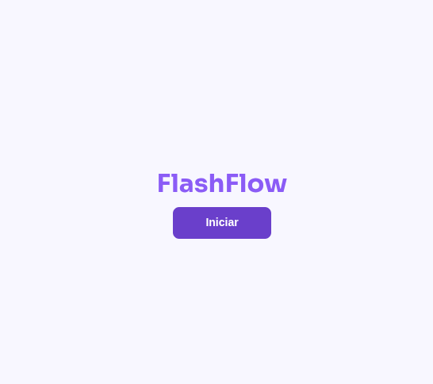
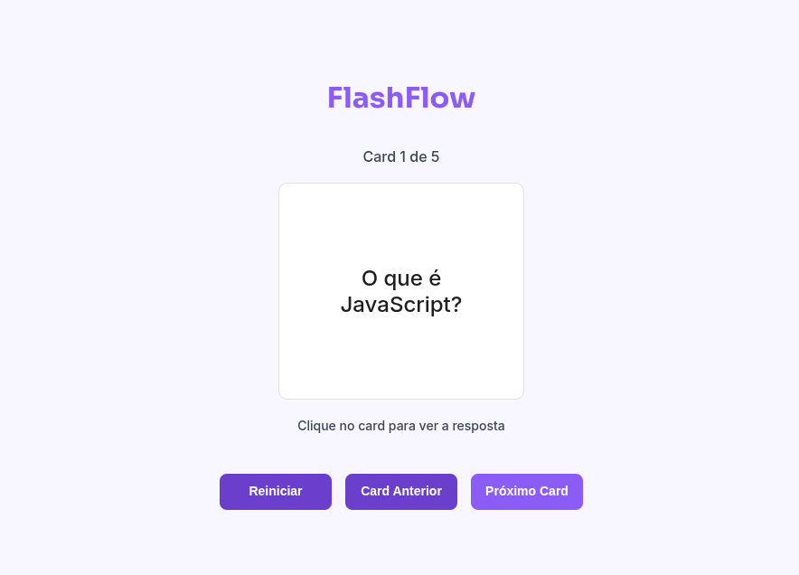

# FlashFlow

Projeto desenvolvido como desafio da minha pós-graduação, com o objetivo de praticar os conhecimentos adquiridos em **HTML**, **CSS** e **JavaScript**. Desafio criado pela **Faculdade de Tecnologia Rocketseat**.




## 📂 Estrutura do Projeto
flashflow/  
|── prints  
│── index.html  
│── styles.css  
│── script.js

## 🚀 Funcionalidades

### Branch `master` (funcionalidades obrigatórias)
- Iniciar o flashcard.
- Exibir a pergunta do card atual.
- Ao clicar no card, exibir a resposta.
- Avançar para o próximo card.
- Atualizar o texto `Card X de Y`.

### Branch `extra-functionalities`
- Botão para voltar ao card anterior.
- Botão para reiniciar os flashcards.

## 🛠 Tecnologias Utilizadas
- **HTML5**
- **CSS3**
- **JavaScript**

## 🎯 Objetivo
Esse projeto foi construído como prática para reforçar conceitos fundamentais de desenvolvimento web, especialmente estruturação semântica de HTML, manipulação de DOM, controle de estado, estrutura de dados (array), lógicas condicionais e estilização com CSS.

## 📌 Como Executar
1. Clone este repositório:
   ```bash
   git clone https://github.com/seu-usuario/flashflow.git

2. Acesse a pasta do projeto:
    ```bash
    cd flashflow

🌿 Branches

- master → versão principal com as funcionalidades obrigatórias.
- extra-functionalities → versão com melhorias extras (voltar card e reiniciar).